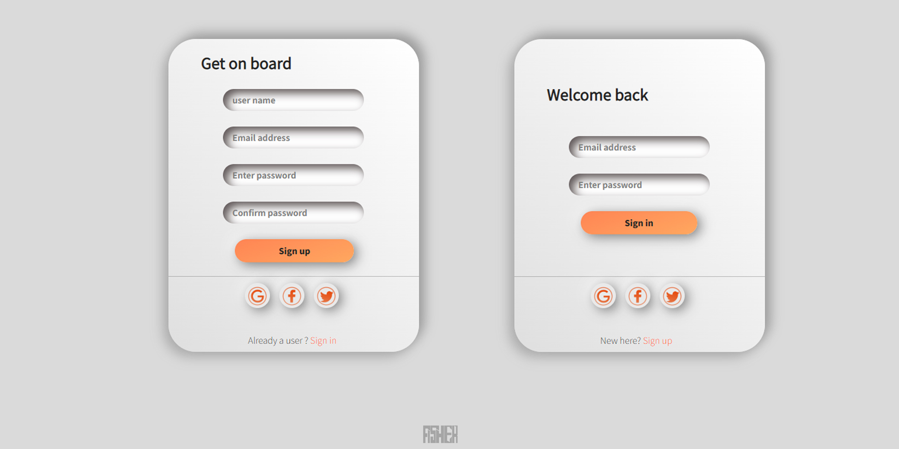
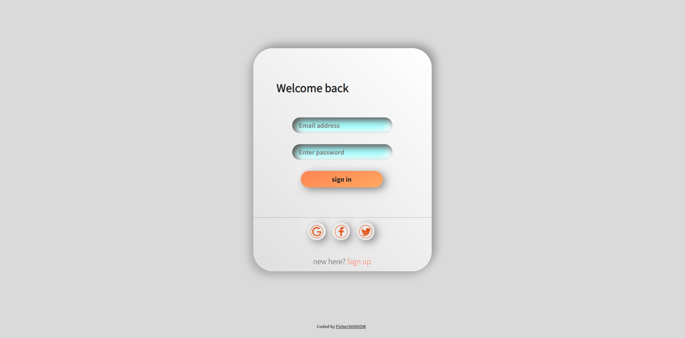

# neumorphism sign up /sign in component

- [Overview](#overview)
- [The challenge](#the-challenge)
- [Screenshot](#screenshot)
- [Links](#links)
- [Built with](#built-with)
- [Author](#author)

## Overview
neumorphism sign up /sign in component created by html /css. 

### Screenshot

### Links

- Live Site URL: [click to see live site](https://fishershadow.github.io/Neumorphism-signup-and-login-component/)

### Built with

- Semantic HTML5 markup
- CSS custom properties
- Adobe Illustrator
- Adobe Photoshop

## Author

- Fisher__SHADOW - [@FisherSHADOW]()
